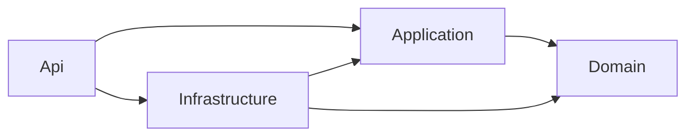

# 01 — Project Scaffold & Data Model

**Status: Implemented** (2026-07-06). Backend scaffold, data model, initial migration, seed, Angular RTL shell, and smoke tests are in place. Business logic for auth, booking, payments, and dashboards is deferred to specs 02–08.

## 1. Architecture: Pragmatic Clean Architecture

The backend follows **Clean Architecture** with four layers, applied pragmatically (see §1.3 for the deliberate simplifications). Dependencies point **inward only** — outer layers depend on inner layers, never the reverse.

### 1.1 Dependency Flow



- **Domain** depends on nothing (no EF, no ASP.NET, no external services).
- **Application** depends only on Domain. It defines interfaces (e.g. `IFileStorage`, `IEmailSender`, `IApplicationDbContext`) that outer layers implement.
- **Infrastructure** implements those interfaces (EF Core, Azure Blob storage, email) and depends on Application + Domain.
- **Api** is the entry point: controllers call Application use-cases; it wires up (DI) the Infrastructure implementations at startup. Api never contains business logic.

### 1.2 Repository Layout (Monorepo)

```
Shora/
├── specs/                          # Spec-driven documentation (01–08)
├── src/
│   ├── frontend/                   # Angular 21 (standalone, RTL Arabic shell)
│   │
│   └── backend/                    # .NET 10 solution
│       ├── Shora.slnx
│       ├── Shora.Domain/           # Entities, enums, domain rules. No external dependencies.
│       ├── Shora.Application/      # Use-case service stubs, abstraction interfaces, DTOs (later specs)
│       ├── Shora.Infrastructure/   # EF Core DbContext + migrations, seed, stub email/file providers
│       ├── Shora.Api/              # ASP.NET Core Web API: controllers, DI wiring, Identity registration
│       └── Shora.Tests/            # xUnit smoke tests
├── .gitignore
└── README.md
```

### 1.3 Pragmatic Simplifications

- **No repository/unit-of-work wrappers over EF Core.** EF's `DbContext` already is a unit-of-work + repository. The Application layer talks to the database through a thin `IApplicationDbContext` interface (exposing `DbSet`s + `SaveChangesAsync`) implemented by the Infrastructure `ApplicationDbContext`. This keeps the Application layer testable/mockable without adding a repository abstraction per entity.
- **MediatR is optional.** Use-cases can start as plain injectable service classes (e.g. `BookingService`, `PaymentService`). MediatR/CQRS can be introduced later if the number of use-cases grows enough to justify it — not required for MVP.
- **DTOs only at boundaries.** Request/response DTOs live in Application; entities are never returned directly from controllers, but we don't add mapping ceremony beyond what's useful.

Rationale: this keeps external, swappable concerns (payments, email) behind interfaces so the core booking/refund logic is unit-testable and gateway-agnostic, while avoiding the file-count explosion that full CQRS + per-entity repositories would add to what is fundamentally a small booking app.

## 2. Backend Scaffold

- **Target framework**: .NET 10, all four backend projects on the same version.

### 2.1 Layer Responsibilities & Key Types

- **Domain** — entities and enums from §4 (`ApplicationUser`, `Booking`, `CancellationRequest`, `Payment`, `PaymentReceipt`, `AvailabilitySlot`, `AvailabilityWindow`, `BlockedDate`, `Settings`), plus domain enums and any invariant rules (e.g. a `Booking` cannot be confirmed without an admin-approved payment). No EF attributes required (mapping configured in Infrastructure).
- **Application** — the use-cases and the interfaces they depend on:
  - Use-case services: `BookingService`, `PaymentService` (receipt upload + admin approve/decline + manual refund), `CancellationService` (cancellation requests + decisions), `AvailabilityService`, `SettingsService`, `AuthService` (orchestration around Identity).
  - Abstraction interfaces (implemented by Infrastructure): `IApplicationDbContext`, `IFileStorage` (stores receipt images in a private blob container, issues short-lived read URLs), `IEmailSender`, `IDateTimeProvider` (so time-based logic like the upload deadline and cancellation auto-decline is testable), `ICurrentUser` (resolves the authenticated user id/role).
  - Request/response DTOs and validation (e.g. FluentValidation or DataAnnotations).
- **Infrastructure** — concrete implementations (spec 01 scope):
  - `ApplicationDbContext : IdentityDbContext<ApplicationUser, IdentityRole<Guid>, Guid>` implementing `IApplicationDbContext`; fluent entity configurations in `Persistence/Configurations/`; initial migration `20260706205915_InitialCreate`.
  - `SystemDateTimeProvider : IDateTimeProvider` — live UTC clock.
  - `NoOpEmailSender : IEmailSender` — stub; real SMTP in spec 02/08.
  - `NotImplementedFileStorage : IFileStorage` — throws until spec 05 (Azure Blob).
  - `HttpContextCurrentUser : ICurrentUser` — minimal; full auth wiring in spec 02.
  - `DatabaseSeeder` — idempotent seed for roles, singleton `Settings`, and admin user from config.
  - **Deferred to later specs:** `BlobFileStorage`, real `EmailSender`, and all background jobs (receipt-deadline cleanup, cancellation auto-decline, auto-complete, slot top-up, refresh-token purge, outbox dispatcher — see spec 08).
- **Api** — ASP.NET Core Web API, Controllers (not minimal APIs). OpenAPI enabled in Development (`/openapi/v1.json`). Identity registered here; JWT auth stubbed (spec 02). `GET /api/health` validates the scaffold. Controllers for booking, payments, etc. are added in specs 04–07.

### 2.2 Configuration

- **appsettings.json** structure (secrets via `dotnet user-secrets` / environment variables in real deployments, never committed):
  - `ConnectionStrings:DefaultConnection` — SQL Server connection string (`Database=Shora` in dev)
  - `Jwt:Issuer`, `Jwt:Audience`, `Jwt:SigningKey` — JWT auth (see spec 02); issuer/audience default to `Shora` / `Shora.Web`
  - `Storage:ConnectionString`, `Storage:ReceiptContainer` — Azure Blob Storage for receipt images (private container); used in spec 05
  - `Google:ClientId`, `Google:ClientSecret` — Google sign-in (see spec 02)
  - `Email:*` — provider/SMTP settings for `EmailSender` (password reset + all client/admin notifications). Email is the only notification channel; no SMS.
  - `AdminSeed:Email`, `AdminSeed:Password` — seeded admin user (dev via `appsettings.Development.json`; production via secrets)
  - `Seed:ConsultantWhatsAppNumber`, `Seed:VodafoneCashNumber`, `Seed:InstaPayHandle`, `Seed:PaymentInstructions` — defaults for the singleton `Settings` row on first run

## 3. Frontend Scaffold

- **Angular version**: 21 (standalone components, no feature NgModules). App lives in `src/frontend/` (npm package name `shora-web`).
- **Structure** (implemented):
  ```
  src/app/
  ├── core/auth/       # auth.service, auth.guard, auth.interceptor — placeholders (spec 02)
  ├── shared/
  │   ├── layout/      # ShellComponent (RTL nav + router-outlet)
  │   └── components/  # PlaceholderPageComponent for lazy route stubs
  ├── public/
  │   ├── home/        # Minimal Arabic home page
  │   ├── about/       # Placeholder
  │   └── services/    # Placeholder
  ├── booking/         # Lazy route stub → spec 04
  ├── client-dashboard/# Lazy route stub → spec 06
  ├── admin-dashboard/ # Lazy route stub → spec 07
  └── auth/            # Lazy route stub → spec 02
  ```
- **Localization/RTL**: `<html lang="ar" dir="rtl">` in `index.html`; Arabic-friendly font stack in global `styles.scss`; no i18n library (Arabic-only site).
- **Styling**: CSS custom properties in `styles.scss` (warm palette: `--color-primary`, `--color-background`, spacing, radius). Component-level SCSS elsewhere.
- **Routing**: lazy-loaded feature routes via `app.routes.ts`; API base URL in `src/environments/environment.ts` → `https://localhost:7183/api`.

## 4. Data Model (detailed)

Builds on the high-level ERD in the SDD (§7). Per the architecture in §1, these are **Domain entities** (plain C# classes, no EF attributes); their table mapping and relationships are configured in the **Infrastructure** layer's EF Core entity configurations, and they are persisted via `ApplicationDbContext` (exposed to the Application layer as `IApplicationDbContext`).

**Timezone convention (cross-cutting):** all `DateTime` fields below are stored in **UTC**. Conversion to the visitor's local browser timezone happens in the Angular UI only. The database and API never deal in local time.

### `ApplicationUser` (extends `IdentityUser<Guid>`)

| Field       | Type                     | Notes                                                                                                                                                                        |
| ----------- | ------------------------ | ---------------------------------------------------------------------------------------------------------------------------------------------------------------------------- |
| DisplayName | `string`                 | Defaulted from the Google profile name or the email local-part at signup; editable and may be a pseudonym per SDD §5.7                                                       |
| Email       | `string`                 | **Required and unique.** Every account has an email (either entered for email/password signup, or provided by Google). Used for login and the password-reset path (spec 02). |
| Role        | `enum { Client, Admin }` | Enforced via Identity roles, mirrored here for convenience queries                                                                                                           |

Notes:

- **No phone field at the account level.** Phone is not collected at signup and is not verified. A contact phone is captured per-booking only when needed for a voice call (see `Booking.ContactPhone` below).
- **External logins (Google)** are supported via ASP.NET Core Identity's external-login linking (`AspNetUserLogins`); a Google account is linked to the `ApplicationUser` (see spec 02).
- **Email verification required before booking** (confirmed): Identity's built-in `EmailConfirmed` flag is used. Email/password signups must verify via an emailed link before they can reserve a slot (spec 02 §7, spec 04); Google accounts are marked confirmed automatically (Google has already verified the address).

### `AvailabilitySlot`

| Field     | Type       | Notes                                                                                           |
| --------- | ---------- | ----------------------------------------------------------------------------------------------- |
| Id        | `Guid`     |                                                                                                 |
| StartTime | `DateTime` | UTC. **Unique index** — see below                                                               |
| EndTime   | `DateTime` | `StartTime + 60min` (session duration from `Settings.SessionDurationMinutes`)                   |
| IsBooked  | `bool`     |                                                                                                 |
| BookingId | `Guid?`    | FK, nullable until booked. Points to the **currently active holder** of this slot only (if any) |

**Uniqueness & generation concurrency (M1):** a **unique index on** `StartTime` prevents duplicate slots. All slot materialization (on-save regeneration in spec 07 and the nightly top-up job) runs through a **single serialized generation path** guarded by the same DB lease as other background jobs (see §2.1 / spec 08), so on-save and the top-up job can never race to insert the same slot. Generation is idempotent: it upserts missing slots and never touches booked ones.

**Booking/slot consistency invariant:** `AvailabilitySlot` is the lock; `Booking.AvailabilitySlotId` is set only while the booking **currently holds** the slot. Historical times live in `SlotStartUtc`/`SlotEndUtc` snapshots (not the FK). All changes run in one DB transaction:

- **reserve:** set `Booking.Status = PendingPayment`, `Booking.AvailabilitySlotId = slotId`, snapshot `SlotStartUtc`/`SlotEndUtc`, `AvailabilitySlot.IsBooked = true`, `AvailabilitySlot.BookingId = bookingId` — slot claim is atomic (`UPDATE ... WHERE IsBooked = 0`, spec 04 §5);
- **release** (cancel, auto-cancel, completion, or any path that frees the slot): set `AvailabilitySlot.IsBooked = false`, `AvailabilitySlot.BookingId = null`, and **`Booking.AvailabilitySlotId = null`** in the same transaction.

**Concurrency (defense in depth):**

- **Primary:** atomic slot-row update on `IsBooked` (spec 04 §5).
- **Secondary:** filtered **unique** index on `Booking(AvailabilitySlotId) WHERE AvailabilitySlotId IS NOT NULL` — at most one booking linked to a slot at a time; cleared on release so a slot can be re-booked after cancel without conflicting with old rows.
- **Secondary:** filtered **unique** index on `AvailabilitySlot(BookingId) WHERE BookingId IS NOT NULL` — a booking cannot hold two slots.

Generated from admin-defined recurring weekly windows (see spec 07) — the windows themselves are stored separately as `AvailabilityWindow` (recurring rule), and concrete `AvailabilitySlot` rows are materialized from them. The exact packing rule (session + buffer, trailing partial handling) is defined in spec 07 §2.

### `AvailabilityWindow` (admin-defined recurring rule — supports spec 07)

| Field     | Type       | Notes                                                                              |
| --------- | ---------- | ---------------------------------------------------------------------------------- |
| Id        | `Guid`     |                                                                                    |
| DayOfWeek | `enum`     |                                                                                    |
| StartTime | `TimeSpan` | e.g. 16:00 — **in the consultant's local time, fixed to Africa/Cairo** (confirmed) |
| EndTime   | `TimeSpan` | e.g. 21:00 — Africa/Cairo                                                          |
| IsActive  | `bool`     |                                                                                    |

**Timezone rule:** window times are entered and stored as Africa/Cairo wall-clock times; slot generation converts them to UTC per concrete date using the IANA `Africa/Cairo` zone (correctly handling Egypt's DST, observed again since 2023). Generated `AvailabilitySlot` rows remain UTC like everything else.

**DST boundary handling (L1):** on the two DST-transition days a local wall-clock time can be _nonexistent_ (spring-forward gap) or _ambiguous_ (fall-back overlap). The generator resolves these deterministically: a nonexistent local time is shifted forward by the DST offset; an ambiguous local time uses the earlier (pre-transition) offset. Practically the configured evening windows never touch the ~00:00 transition, so this is a documented safeguard rather than an expected case.

### `BlockedDate` (admin-defined vacation/unavailable range — supports spec 07)

| Field    | Type       | Notes                                 |
| -------- | ---------- | ------------------------------------- |
| Id       | `Guid`     |                                       |
| StartUtc | `DateTime` | Start of the blocked range (UTC)      |
| EndUtc   | `DateTime` | End of the blocked range (UTC)        |
| Reason   | `string?`  | Optional admin note (e.g. "vacation") |

Creating a `BlockedDate` is **rejected** if the range overlaps any `AvailabilitySlot` tied to a booking in an active state (`PendingPayment`, `PendingApproval`, `Confirmed`, `CancellationRequested`, `Completed`) — the admin cannot block a date a client has reserved. The API returns an error identifying the conflicting booking(s) so the admin can cancel them first if they really intend to block that range. When the range is free, the overlapping unbooked `AvailabilitySlot`s are removed/hidden.

### `Booking`

| Field                    | Type                                                                                               | Notes                                                                                                                                                                                                                                                                                                                                                                                                                                                                                                                                                                                                             |
| ------------------------ | -------------------------------------------------------------------------------------------------- | ----------------------------------------------------------------------------------------------------------------------------------------------------------------------------------------------------------------------------------------------------------------------------------------------------------------------------------------------------------------------------------------------------------------------------------------------------------------------------------------------------------------------------------------------------------------------------------------------------------------- |
| Id                       | `Guid`                                                                                             |                                                                                                                                                                                                                                                                                                                                                                                                                                                                                                                                                                                                                   |
| ClientId                 | `Guid`                                                                                             | FK to `ApplicationUser`                                                                                                                                                                                                                                                                                                                                                                                                                                                                                                                                                                                           |
| AvailabilitySlotId       | `Guid?`                                                                                            | FK to the reserved slot **while the booking holds it**; cleared on release (`null` when `Cancelled`/`Completed` and slot freed). `ON DELETE SET NULL` if the slot row is removed. History uses `SlotStartUtc`/`SlotEndUtc`, not this FK                                                                                                                                                                                                                                                                                                                                                                           |
| SlotStartUtc             | `DateTime`                                                                                         | **Snapshot** of the slot's start time, copied at reserve time. All history views and time guards read this, never the slot row                                                                                                                                                                                                                                                                                                                                                                                                                                                                                    |
| SlotEndUtc               | `DateTime`                                                                                         | Snapshot of the slot's end time, copied at reserve time                                                                                                                                                                                                                                                                                                                                                                                                                                                                                                                                                           |
| DeliveryMethod           | `enum { VoiceCall, Chat }`                                                                         |                                                                                                                                                                                                                                                                                                                                                                                                                                                                                                                                                                                                                   |
| ContactPhone             | `string?`                                                                                          | Captured at booking time; **required when** `DeliveryMethod = VoiceCall` (so the consultant can call), otherwise null. Never collected at signup; visible only to the **admin and the owning client** (the client dashboard shows it in the "you'll receive a call on…" instructions, spec 06) — never to other clients or public endpoints.                                                                                                                                                                                                                                                                      |
| Status                   | `enum { PendingPayment, PendingApproval, Confirmed, CancellationRequested, Completed, Cancelled }` | `PendingPayment` = reserved, awaiting the client's receipt upload; `PendingApproval` = receipt uploaded, awaiting admin review; `CancellationRequested` = client has asked to cancel a confirmed booking, awaiting the admin's decision (spec 04 §3). `Completed` is set **automatically** by a background job once `SlotEndUtc` has passed (see spec 07) — there is no manual "mark completed" action. A booking is also set to `Cancelled` **automatically** when its receipt-upload deadline expires while still `PendingPayment` (spec 04 §4) — no booking stays `PendingPayment` after its slot is released. |
| ReceiptUploadDeadlineUtc | `DateTime?`                                                                                        | UTC. Set when the booking enters `PendingPayment` (reserve, or after a declined receipt) to `now + Settings.ReceiptUploadWindowMinutes`. The cleanup job cancels the booking if no receipt is uploaded by this time. Null once a receipt is under review (`PendingApproval`) — no auto-cancel while awaiting the admin.                                                                                                                                                                                                                                                                                           |
| CreatedAt                | `DateTime`                                                                                         | UTC                                                                                                                                                                                                                                                                                                                                                                                                                                                                                                                                                                                                               |
| RowVersion               | `rowversion`                                                                                       | **Optimistic-concurrency token.** Every status transition is a conditional update (`WHERE Status = expectedStatus`, token checked); when two actors race (e.g. client cancellation request vs admin approve vs the auto-decline job), exactly one transition commits and the loser gets a conflict (HTTP 409) — never two audit rows or duplicate emails for one transition.                                                                                                                                                                                                                                      |

**Slot-history rule:** booking history never depends on the slot row surviving. `SlotStartUtc`/`SlotEndUtc` are snapshotted onto the booking at reserve time, so dashboards (specs 06/07) and time guards (spec 04 §4) always work even if the underlying unbooked `AvailabilitySlot` is later removed by regeneration or a `BlockedDate` (the FK is nullable with `SET NULL`). Slots referenced by an **active** booking are never removed (spec 07 §2).

### `BookingStatusAudit` (status-change audit trail — supports H6)

| Field       | Type                             | Notes                                                                                                                                                                                                                     |
| ----------- | -------------------------------- | ------------------------------------------------------------------------------------------------------------------------------------------------------------------------------------------------------------------------- |
| Id          | `Guid`                           |                                                                                                                                                                                                                           |
| BookingId   | `Guid`                           | FK to `Booking`                                                                                                                                                                                                           |
| FromStatus  | `enum?`                          | Booking status before the change; null for the initial creation row                                                                                                                                                       |
| ToStatus    | `enum`                           | Booking status after the change                                                                                                                                                                                           |
| Actor       | `enum { Client, Admin, System }` | Who caused the transition — `System` covers background jobs (upload-deadline auto-cancel, auto-complete, cancellation-request auto-decline)                                                                               |
| ActorUserId | `Guid?`                          | FK to `ApplicationUser` when `Actor` is `Client`/`Admin`; null for `System`                                                                                                                                               |
| Reason      | `string?`                        | Optional human-readable reason (e.g. "receipt declined: amount mismatch", "cancelled by consultant", "receipt not uploaded in time", "cancellation request auto-declined") — feeds the cancelled-reason labels in spec 06 |
| AtUtc       | `DateTime`                       | UTC timestamp of the transition                                                                                                                                                                                           |

Every booking status transition writes one row **inside the same DB transaction** as the status change, so the trail can never disagree with the booking's current state. This is the audit source referenced by spec 07 (admin monitoring) and spec 06 (client-facing cancellation reason).

### `CancellationRequest` (client-initiated cancellation, admin-reviewed)

| Field                   | Type                                                 | Notes                                                                                                                                                                                                         |
| ----------------------- | ---------------------------------------------------- | ------------------------------------------------------------------------------------------------------------------------------------------------------------------------------------------------------------- |
| Id                      | `Guid`                                               |                                                                                                                                                                                                               |
| BookingId               | `Guid`                                               | FK, **unique** — one canonical request record per booking                                                                                                                                                     |
| RequestedByClientId     | `Guid`                                               | FK to `ApplicationUser` (the owning client)                                                                                                                                                                   |
| RequestedAtUtc          | `DateTime`                                           | UTC                                                                                                                                                                                                           |
| ClientReason            | `string?`                                            | Optional free-text reason supplied by the client                                                                                                                                                              |
| AutoDeclineAtUtc        | `DateTime`                                           | UTC. Snapshot of `Booking.SlotStartUtc - Settings.CancellationRequestAutoDeclineHours` at request time. The auto-decline job (spec 08) declines the request once `now >= AutoDeclineAtUtc` if still `Pending` |
| Status                  | `enum { Pending, Approved, Declined, AutoDeclined }` | See the cancellation-request workflow in spec 04 §3                                                                                                                                                           |
| ReopenCount             | `int`                                                | Number of times a declined request was reopened by the client (max 1)                                                                                                                                         |
| ReviewedByAdminId       | `Guid?`                                              | FK to the admin who approved/declined; null while `Pending` or when `AutoDeclined`                                                                                                                            |
| ReviewedAtUtc           | `DateTime?`                                          | UTC of the admin decision (or the auto-decline)                                                                                                                                                               |
| DecisionReasonCode      | `enum?`                                              | Typed decline reason for analytics/consistency (`TimingConflict`, `InsufficientReason`, `Policy`, `Other`)                                                                                                    |
| DecisionReason          | `string?`                                            | Optional admin note on decline (surfaced to the client, spec 06)                                                                                                                                              |
| ClientDecisionSeenAtUtc | `DateTime?`                                          | UTC when the client acknowledged the latest decline/auto-decline banner (supports deterministic "one-time note" UX in spec 06)                                                                                |

A `CancellationRequest` is created only for a `Confirmed` booking (spec 04 §3); the booking moves to `CancellationRequested` in the same transaction. Approval cancels the booking (and creates a refund-due, spec 05 §6); decline/auto-decline returns it to `Confirmed`. To reduce accidental admin no-response harm, one reopen is allowed after a decline while still before the deadline (`ReopenCount <= 1`).

### `Payment`

| Field                  | Type                                                              | Notes                                                                                                                                                                                                                                                                                                                                                                                                                                               |
| ---------------------- | ----------------------------------------------------------------- | --------------------------------------------------------------------------------------------------------------------------------------------------------------------------------------------------------------------------------------------------------------------------------------------------------------------------------------------------------------------------------------------------------------------------------------------------- |
| Id                     | `Guid`                                                            |                                                                                                                                                                                                                                                                                                                                                                                                                                                     |
| BookingId              | `Guid`                                                            | FK, **1:1 (unique index)**                                                                                                                                                                                                                                                                                                                                                                                                                          |
| Method                 | `enum { VodafoneCash, InstaPay }?`                                | The transfer method the client used, captured on receipt upload; null before the first upload                                                                                                                                                                                                                                                                                                                                                       |
| Status                 | `enum { AwaitingReceipt, UnderReview, Approved, Refunded, Void }` | See the payment state machine in spec 05. `AwaitingReceipt` = reserved, no receipt yet; `UnderReview` = a receipt is pending admin review; `Approved` = admin verified the transfer (booking confirmed) **or refund-due reopened after a mistaken refund record was revoked**; `Refunded` = admin recorded a manual out-of-band refund after cancellation; `Void` = booking cancelled/expired before any receipt was approved (no money confirmed). |
| Amount                 | `decimal(10,2)`                                                   | Session price in **EGP major units**, snapshot at **booking reserve time** so admin price changes never alter an already-started booking                                                                                                                                                                                                                                                                                                            |
| Currency               | `string`                                                          | ISO code, `"EGP"`                                                                                                                                                                                                                                                                                                                                                                                                                                   |
| RefundedAtUtc          | `DateTime?`                                                       | UTC when the admin recorded the manual refund (`refunds/record`, spec 05 §6)                                                                                                                                                                                                                                                                                                                                                                        |
| RefundReference        | `string?`                                                         | Admin-entered reference/note for the out-of-band refund transfer (Vodafone Cash/InstaPay)                                                                                                                                                                                                                                                                                                                                                           |
| RefundedByAdminId      | `Guid?`                                                           | FK to the admin who recorded the refund                                                                                                                                                                                                                                                                                                                                                                                                             |
| RefundRevokedAtUtc     | `DateTime?`                                                       | UTC when an incorrectly recorded refund was revoked (`refunds/revoke`)                                                                                                                                                                                                                                                                                                                                                                              |
| RefundRevokedByAdminId | `Guid?`                                                           | FK to the admin who revoked the mistaken refund record                                                                                                                                                                                                                                                                                                                                                                                              |
| RefundRevocationReason | `string?`                                                         | Mandatory reason for correction; immutable audit trail                                                                                                                                                                                                                                                                                                                                                                                              |
| CreatedAt              | `DateTime`                                                        | UTC. Row is **created when the booking is reserved** (`POST /api/bookings`) in `AwaitingReceipt`                                                                                                                                                                                                                                                                                                                                                    |
| UpdatedAt              | `DateTime`                                                        | UTC, updated on every status change                                                                                                                                                                                                                                                                                                                                                                                                                 |

Receipt image attempts are tracked in the separate `PaymentReceipt` table (one row per upload attempt) so the history survives declines and re-uploads.

**Money precision rule:** admin-configured `SessionPrice` must have max 2 fractional digits (EGP rule) and is persisted with fixed precision (`decimal(10,2)`). Values with >2 decimals are rejected at `PUT /api/admin/settings` and cannot be stored. `Payment.Amount` copies this normalized value at reserve time.

### `PaymentReceipt` (uploaded transfer proof — one row per attempt)

| Field             | Type                                                             | Notes                                                                                                                |
| ----------------- | ---------------------------------------------------------------- | -------------------------------------------------------------------------------------------------------------------- |
| Id                | `Guid`                                                           |                                                                                                                      |
| PaymentId         | `Guid`                                                           | FK to `Payment`                                                                                                      |
| BlobPath          | `string`                                                         | Path/key of the stored image in the **private** Azure Blob container (random name; never a public URL — see spec 05) |
| OriginalFileName  | `string`                                                         | As uploaded (for admin display only; never used as the stored name)                                                  |
| ContentType       | `string`                                                         | Validated against the allowlist (jpeg/png/webp/pdf)                                                                  |
| ContentHashSha256 | `string`                                                         | Strong file fingerprint for duplicate/replay detection                                                               |
| SizeBytes         | `long`                                                           | Enforced against the max-size limit (spec 05)                                                                        |
| SenderReference   | `string?`                                                        | Optional client-entered sender name / transaction reference                                                          |
| UploadedAtUtc     | `DateTime`                                                       | UTC                                                                                                                  |
| BlobState         | `enum { TempUploaded, Finalized, BlobFinalizePending, Missing }` | Tracks external blob lifecycle so DB/blob divergence is visible/recoverable                                          |
| MalwareScanStatus | `enum { Pending, Clean, Suspicious, Blocked }`                   | Receipt is reviewable only when `Clean`                                                                              |
| ReviewStatus      | `enum { Pending, Approved, Declined }`                           | Admin's decision on this specific attempt                                                                            |
| ReviewedByAdminId | `Guid?`                                                          | FK to the reviewing admin; null while `Pending`                                                                      |
| ReviewedAtUtc     | `DateTime?`                                                      | UTC of the review                                                                                                    |
| DeclineReasonCode | `enum?`                                                          | Typed reason (`UnreadableImage`, `AmountMismatch`, `DuplicateReceipt`, `UnverifiableTransfer`, `Other`)              |
| DeclineReason     | `string?`                                                        | Optional admin note when this attempt is declined (surfaced to the client, spec 06)                                  |

At most one `PaymentReceipt` is `Pending` per payment at a time (a new upload is only allowed while the booking is `PendingPayment`). Approving the latest attempt confirms the booking; declining it returns the booking to `PendingPayment` with a fresh `ReceiptUploadDeadlineUtc`.

### Cross-entity invariants

These are enforced in domain/application guards and validated in tests:

- `Booking.Status = PendingPayment` => `Payment.Status = AwaitingReceipt` and `ReceiptUploadDeadlineUtc != null`.
- `Booking.Status = PendingApproval` => `Payment.Status = UnderReview`, latest `PaymentReceipt.ReviewStatus = Pending`, `ReceiptUploadDeadlineUtc = null`.
- `Booking.Status = Confirmed` => `Payment.Status = Approved`.
- `Booking.Status = CancellationRequested` => `Payment.Status = Approved` and `CancellationRequest.Status = Pending`.
- `Booking.Status = Cancelled` and `Payment.Status = Refunded` => `RefundedAtUtc != null`.
- A booking can never be `Confirmed` with `Payment.Status IN (AwaitingReceipt, UnderReview, Void)`.
- A booking holds a slot iff `AvailabilitySlotId IS NOT NULL` (cleared on release); at most one booking per slot (unique index) and one slot per booking holder (unique index on `AvailabilitySlot.BookingId`).

### `Settings` (single-row table)

| Field                               | Type            | Notes                                                                                                                                                                                                   |
| ----------------------------------- | --------------- | ------------------------------------------------------------------------------------------------------------------------------------------------------------------------------------------------------- |
| Id                                  | `int`           | **Singleton key, fixed to** `1` (enforced at DB level)                                                                                                                                                  |
| SessionPrice                        | `decimal(10,2)` | Default 500 EGP, admin-editable                                                                                                                                                                         |
| SessionDurationMinutes              | `int`           | Default 60, admin-editable                                                                                                                                                                              |
| BufferMinutes                       | `int`           | Default 15                                                                                                                                                                                              |
| ConsultantWhatsAppNumber            | `string`        | Admin-editable. Used to build the `wa.me` chat link (spec 04) and "contact the consultant" messages (spec 06). Never exposed via a public list, only embedded in a confirmed client's own booking link. |
| VodafoneCashNumber                  | `string`        | Admin-editable. The Vodafone Cash number the client transfers the session fee to; shown in the payment instructions (spec 04/05).                                                                       |
| InstaPayHandle                      | `string`        | Admin-editable. The InstaPay address/handle (IPA) the client transfers to; shown in the payment instructions.                                                                                           |
| PaymentInstructions                 | `string?`       | Optional admin-editable free-text shown alongside the transfer details (e.g. "put your name in the transfer note").                                                                                     |
| ReceiptUploadWindowMinutes          | `int`           | Default 60. How long a client has to upload a receipt after reserving (or after a declined receipt) before the hold is auto-cancelled (spec 04 §4).                                                     |
| CancellationRequestAutoDeclineHours | `int`           | Default 1. A client cancellation request is auto-declined at `SlotStartUtc - this` if the admin hasn't acted; a request cannot be submitted once less than this remains (spec 04 §3).                   |
| ReceiptRetentionMonths              | `int`           | Default 24. How long receipt images are retained before secure purge/anonymization (spec 08 §5).                                                                                                        |

**Validation constraints (H4)** — enforced both in the Application layer (FluentValidation) when the admin saves and as CHECK-style guards, so a bad edit can never corrupt scheduling/pricing:

- `SessionPrice` > 0.
- `SessionPrice` has at most 2 decimal places (EGP minor-unit precision).
- `SessionDurationMinutes` between 30 and 240.
- `BufferMinutes` >= 0 (and `SessionDurationMinutes + BufferMinutes` must divide a window sensibly — see spec 07 §2).
- `ReceiptUploadWindowMinutes` >= 5.
- `CancellationRequestAutoDeclineHours` >= 0.
- `ReceiptRetentionMonths` between 1 and 60.
- `ConsultantWhatsAppNumber` must be a valid E.164 number (e.g. `+2010xxxxxxxx`).
- `VodafoneCashNumber` must be a valid Egyptian mobile number (E.164 or local `01xxxxxxxxx`).
- `InstaPayHandle` non-empty when set (free-form IPA/handle).
  Changing `SessionDurationMinutes`/`BufferMinutes` only affects **future** slot generation; already-generated and booked slots keep their original duration (the snapshot lives on `AvailabilitySlot`). The admin UI surfaces these same rules (spec 07).

**Singleton enforcement:** `PUT /api/admin/settings` always updates row `Id = 1` (upsert-if-missing at startup only). The table carries a `CHECK (Id = 1)` **constraint** (added in the initial migration) so a second row is structurally impossible at the database level — the PK alone only guarantees uniqueness, not that the single row is `Id = 1`.

### `OutboxMessage` (reliable side-effect delivery)

| Field            | Type                                        | Notes                                                                                       |
| ---------------- | ------------------------------------------- | ------------------------------------------------------------------------------------------- |
| Id               | `Guid`                                      |                                                                                             |
| MessageType      | `string`                                    | e.g. `ClientBookingConfirmedEmail`, `AdminNewBookingEmail`, `ClientRefundEmail`             |
| AggregateType    | `string`                                    | e.g. `Booking`                                                                              |
| AggregateId      | `Guid`                                      | e.g. `BookingId`                                                                            |
| IdempotencyKey   | `string`                                    | Unique key (e.g. `bookingId:messageType`) so retries never double-send                      |
| PayloadJson      | `string`                                    | Serialized template/input payload                                                           |
| CreatedAtUtc     | `DateTime`                                  | UTC                                                                                         |
| NextAttemptAtUtc | `DateTime`                                  | UTC                                                                                         |
| AttemptCount     | `int`                                       |                                                                                             |
| Status           | `enum { Pending, Processed, DeadLettered }` | `DeadLettered` after `MaxAttempts` (8) failed deliveries — the dispatcher stops retrying it |
| ProcessedAtUtc   | `DateTime?`                                 | UTC when delivered                                                                          |
| LastError        | `string?`                                   | Last delivery failure detail                                                                |

Any side effect that must be reliable (emails, future integrations) is written as an `OutboxMessage` **in the same DB transaction** as the state transition that triggered it. A background dispatcher job sends and marks processed with retry/backoff. **Dead-letter policy:** after 8 failed attempts (exponential backoff, ~last attempt ≈ 24h after creation) the message is marked `DeadLettered`, an alert fires (spec 08 §2), and it is only retried again by explicit admin/operator action — a permanently broken message can never wedge the dispatcher or retry forever.

## 5. Migrations & Seed Data

- **Initial migration** (`Shora.Infrastructure/Persistence/Migrations/20260706205915_InitialCreate`) creates Identity tables + all domain tables above, including:
  - Unique indexes: `AvailabilitySlot.StartTime`, `Payment.BookingId`, `CancellationRequest.BookingId`, `OutboxMessage.IdempotencyKey`, `RefreshToken.TokenHash`
  - Filtered unique index on `Booking(AvailabilitySlotId) WHERE AvailabilitySlotId IS NOT NULL`
  - Filtered unique index on `AvailabilitySlot(BookingId) WHERE BookingId IS NOT NULL`
  - Non-unique index on `PaymentReceipt.ContentHashSha256`
  - `CHECK (Id = 1)` constraint on `Settings`
  - `Booking.RowVersion` concurrency token
  - `BookingStatusAudit`, `CancellationRequest`, `PaymentReceipt`, `RefreshToken`, and `OutboxMessage` tables
  - No payment-gateway columns (`Payment` has no provider/order/transaction fields)
- **Admin FK delete behavior:** SQL Server cascade-path constraints require `ON DELETE NO ACTION` (not `SET NULL`) on optional admin-user FKs (`Payment.RefundedByAdminId`, `PaymentReceipt.ReviewedByAdminId`, etc.).
- **Apply migrations:** `dotnet ef database update --project Shora.Infrastructure --startup-project Shora.Api`. On non-test startup, `InitializeDatabaseAsync()` auto-applies pending migrations and runs seed.
- **Seed data** (idempotent, via `DatabaseSeeder`):
  - `Client` and `Admin` Identity roles
  - Singleton `Settings` row (`Id = 1`): 500 EGP, 60 min duration, 15 min buffer, 60 min receipt-upload window, 1h cancellation-request auto-decline, 24-month receipt retention; payment/contact numbers from `Seed:*` config
  - Admin user when `AdminSeed:Email` and `AdminSeed:Password` are configured

## 6. Implementation Verification (spec 01)

| Check                 | Command / endpoint                                           |
| --------------------- | ------------------------------------------------------------ |
| Backend build         | `dotnet build` in `src/backend`                              |
| Tests (6 smoke tests) | `dotnet test` — model, seed, filtered index, health endpoint |
| Database              | `dotnet ef database update` or API startup auto-migrate      |
| Health                | `GET /api/health` → `{ status: "healthy", timestampUtc }`    |
| OpenAPI (dev)         | `/openapi/v1.json`                                           |
| Frontend build        | `npm run build` in `src/frontend`                            |
| Frontend dev          | `npm start` → RTL Arabic shell at `http://localhost:4200`    |

**Namespaces:** all C# code uses the `Shora.`\* root namespace (`Shora.Domain`, `Shora.Application`, `Shora.Infrastructure`, `Shora.Api`).

**Deferred to later specs:** JWT auth, Google login, refresh-token flows (02); public pages API (03); booking/availability (04); receipt upload & blob storage (05); dashboards (06–07); background jobs, outbox dispatcher, rate limiting (08).
