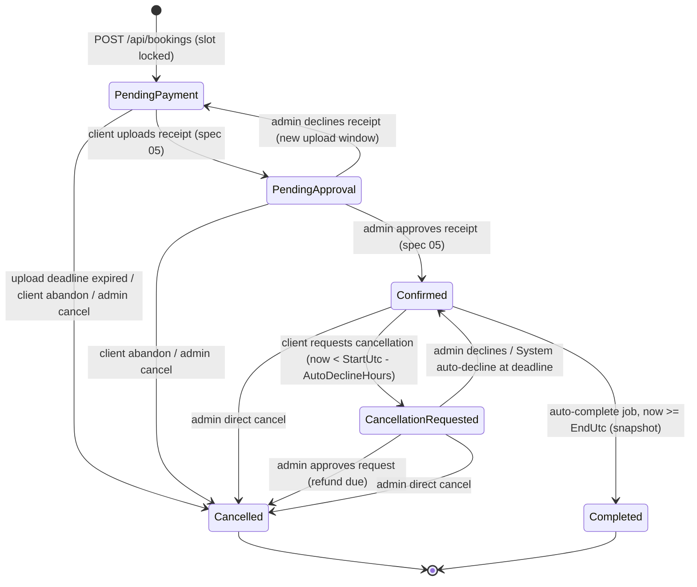

# 04 — Booking Flow

Status: **Spec only — not implemented until explicitly requested.**

## 1. Flow Overview (per SDD §8, flow 1)

`Services page → Pick slot + delivery method → Contact phone (if Voice Call) → Log in / sign up (required to reserve) → Review & confirm → Transfer fee + upload receipt → Confirmation`

Login is deliberately placed **at the reserve step, not the start**: visitors can browse availability and make their selections without an account (lower friction for social-media traffic per SDD §4.3), and are only asked to log in/sign up at the moment they commit to reserving. Booking still always requires an account — there is no guest booking.

## 2. Step-by-Step

### Step 1 — Slot Selection

**Endpoint**: `GET /api/availability?from=&to=` (public, no auth) — returns open `AvailabilitySlot`s (`IsBooked = false`) within a date range, each 60 minutes, with a 15-minute buffer already baked into how slots were generated from admin `AvailabilityWindow`s.

**Query bounds (M3):** both `from` and `to` are required, must satisfy `from < to`, and `to - from` must not exceed the slot-generation horizon (~4 weeks, spec 07 §2). `from` in the past is clamped to `now`. Requests that violate these are rejected with `400`. This prevents unbounded scans and stops callers from probing arbitrarily far into the future (where no slots exist anyway). Only future, unbooked slots inside any active `BlockedDate` are excluded.

Slot times are returned in **UTC**; the Angular UI converts them to the visitor's local browser timezone for display (per the timezone convention in spec 01 §4).

Frontend displays a simple calendar/day-list picker (mobile-first — likely a vertical list of days, each expandable into time slots, rather than a dense desktop-style calendar grid).

### Step 2 — Delivery Method

Client chooses **Voice Call** or **Chat (WhatsApp)**. This determines the confirmation instructions shown later.

### Step 3 — Contact Phone (Voice Call only)

If the client picked **Voice Call**, they enter a `contactPhone` so the consultant can call them (captured per-booking, not at signup — see spec 01 §4). If they picked **Chat**, no phone is needed (the client initiates via the `wa.me` link to the consultant's number).

Validation contract (resolved): `contactPhone` is normalized and stored in E.164 format. `POST /api/bookings` rejects non-normalizable values with a field error. UI shows an example in local context (e.g. Egypt mobile) but the API remains the source of truth.

### Step 4 — Login Required (gate before reserving)

Reserving requires an authenticated client **with a verified email** (spec 02 §7; Google accounts are always verified). If the visitor is not logged in at this point, they are prompted to log in/sign up (email+password or Google, per spec 02) and returned to the flow with their slot, delivery method, and contact phone preserved. If logged in but unverified, the reserve action is replaced with a "verify your email first" prompt and a resend button. There is no guest booking. (The selection is held client-side across the login round-trip; the slot is not locked until Step 5, so it could in rare cases be taken during login — handled by the race-condition check in §5.)

### Step 5 — Review & Reserve

**Endpoint**: `POST /api/bookings` (Client, auth required) — body: `{ availabilitySlotId, deliveryMethod, contactPhone? }`.

Behavior:

- Requires an authenticated client with `EmailConfirmed = true` (spec 02 §7) — rejected otherwise.
- **Concurrent-hold cap (confirmed):** rejected if the client already has **3** un-confirmed holds (`PendingPayment` + `PendingApproval`) — prevents slot-hoarding via unpaid holds or junk receipt uploads. Enforced race-free inside the reserve transaction (see §5); a client can also release a hold early via "Cancel hold" (§3, spec 06).
- Validates `contactPhone` is present when `deliveryMethod = VoiceCall`.
- Validates the slot is still open (race condition protection — see §5 below); if it was taken during login, the client is shown a "slot no longer available" message and returned to Step 1.
- In one transaction: creates `Booking` with status `PendingPayment`, sets `Booking.AvailabilitySlotId`, snapshots `SlotStartUtc`/`SlotEndUtc`, sets `ReceiptUploadDeadlineUtc = now + Settings.ReceiptUploadWindowMinutes` (default 60 min), atomically claims the slot (`AvailabilitySlot.IsBooked = true`, `AvailabilitySlot.BookingId = bookingId` via `UPDATE ... WHERE IsBooked = 0`).
- Creates the 1:1 `Payment` row **in the same transaction** with a frozen price snapshot (`Amount`, `Currency = EGP`, `Status = AwaitingReceipt`). This guarantees the client owes the price they saw at reserve-time even if admin settings change afterward.
- Returns `bookingId` + the frozen snapshot price + the payment instructions (spec 05).

### Step 6 — Payment (manual transfer + receipt upload)

Handled by spec 05. The client transfers the fee to the consultant's Vodafone Cash number or InstaPay handle, then uploads a receipt image (`POST /api/payments/{bookingId}/receipt`). This moves the booking to `PendingApproval`. The booking becomes `Confirmed` only **after the admin approves the receipt** — there is no instant confirmation.

### Step 7 — Confirmation

Confirmation is **not instant**; it follows the admin's approval (the client is notified by email, spec 05/07). Once `Confirmed`, the client sees (and the dashboard shows, spec 06):

- If Voice Call: "The consultant will call you at [date/time] on [contactPhone]."
- If Chat: a **pre-filled `wa.me` link** (confirmed mechanic) is generated using `Settings.ConsultantWhatsAppNumber` (spec 01 §4), e.g. `https://wa.me/<ConsultantWhatsAppNumber>?text=<pre-filled context: client name, booking time>`. The client is instructed to tap this link at the scheduled time to start the WhatsApp chat with the consultant.

## 3. Cancellation / Rescheduling

Client cancellation of a **paid, `Confirmed`** booking is not self-serve. It is a **request the admin manually approves or declines**, with a safety-net auto-decline. Unpaid holds are still cancelled immediately by the client (nothing to refund).

### 3.1 Client cancellation request (Confirmed bookings)

- **Endpoint**: `POST /api/bookings/{id}/cancellation-requests` (Client, owner only; body `{ reason? }`). Behavior:
  - Requires the booking to be `Confirmed` and owned by the caller.
  - **Deadline guard:** allowed only while `now < Booking.SlotStartUtc - Settings.CancellationRequestAutoDeclineHours` (default 1h). If less than the deadline remains, the request is **rejected** ("too late to request online — contact the consultant on WhatsApp"); no request row is created.
  - Creates a `CancellationRequest` (`Status = Pending`, `AutoDeclineAtUtc = SlotStartUtc - CancellationRequestAutoDeclineHours`, `ClientReason`), moves the booking to `CancellationRequested` (writing a `BookingStatusAudit` row), and enqueues an "admin: new cancellation request" email to the outbox.
  - **Re-request rule (hardened):** one canonical request record per booking; if the latest decision is `Declined`, the client may reopen **once** (`ReopenCount <= 1`) while still before the deadline. Reopen resets status to `Pending`. No reopen after `AutoDeclined`.
- **Admin approves** (`POST /api/admin/bookings/{id}/cancellation-requests/approve`, spec 07): sets `CancellationRequest.Status = Approved`, `Booking.Status = Cancelled`, **releases the slot** (`IsBooked = false`, `BookingId = null`, `Booking.AvailabilitySlotId = null`, spec 01). If the payment is `Approved`, this creates a **refund-due** the admin settles manually and records via `refunds/record` (spec 05 §6). A client cancellation/refund email is enqueued.
- **Admin declines** (`POST /api/admin/bookings/{id}/cancellation-requests/decline`, body `{ reasonCode, reasonNote? }`): sets `CancellationRequest.Status = Declined` with typed reason + note, returns `Booking.Status = Confirmed`, and enqueues a "request declined — session stands" email carrying the reason.
- **Auto-decline (safety net):** a background job (spec 08) sets any still-`Pending` request to `AutoDeclined` and returns the booking to `Confirmed` once `now >= AutoDeclineAtUtc` (actor `System`), enqueuing an auto-decline email. This guarantees no pending request survives into the last hour before the session (never collides with auto-complete).
- **Client banner acknowledgement endpoint:** `POST /api/bookings/{id}/cancellation-requests/decision-seen` sets `ClientDecisionSeenAtUtc`, so the "declined/auto-declined" banner behavior is deterministic across devices (spec 06).
- **Decision finality:** after the allowed single reopen is used (or after `AutoDeclined`), the session stands and further online requests are blocked; client is directed to WhatsApp.
- **Rescheduling** is not a distinct feature — a client contacts the consultant, who may cancel+refund at discretion (spec 07) so the client can rebook.

### 3.2 Client abandon of an unpaid hold

A client may cancel their own `PendingPayment` **or** `PendingApproval` booking at **any time** via `POST /api/bookings/{id}/cancel` (Client, owner only) — no deadline applies because nothing has been approved. This immediately **releases the slot** (`IsBooked = false`, `BookingId = null`, `Booking.AvailabilitySlotId = null`), frees one unit of the 3-hold cap, marks the booking `Cancelled`, and sets `Payment.Status = Void` (no money was confirmed received). A plain cancellation email is enqueued.

### 3.3 Admin cancellation (direct)

The admin can cancel **any** booking **any time before the session start** directly (no request needed), from either `Confirmed` or `CancellationRequested`, as well as unpaid holds (spec 07). **Releases the slot** on cancel (spec 01). If the payment is `Approved`, this creates a refund-due settled via `refunds/record` (spec 05 §6); otherwise the payment is set `Void`. Once the session has started/ended (auto-completed), it can no longer be cancelled.

## 4. Booking State Machine (M7)

Every transition below writes a `BookingStatusAudit` row (spec 01) in the same DB transaction, and every transition is guarded by the `Booking.RowVersion` optimistic-concurrency token (spec 01) so racing actors resolve to exactly one winner. `now` always means UTC; `StartUtc`/`EndUtc` are the booking's **snapshotted** `SlotStartUtc`/`SlotEndUtc` (spec 01), never a live slot read.

**Allowed transitions & exact guards:**

| From                    | To                      | Actor  | Guard (time predicate + conditions)                                                                             |
| ----------------------- | ----------------------- | ------ | --------------------------------------------------------------------------------------------------------------- |
| —                       | `PendingPayment`        | Client | Slot atomically claimed (`IsBooked 0→1`), email verified, `< 3` existing un-confirmed holds                     |
| `PendingPayment`        | `PendingApproval`       | Client | Owner uploads a valid receipt before `ReceiptUploadDeadlineUtc` (spec 05)                                       |
| `PendingPayment`        | `Cancelled`             | System | `now >= ReceiptUploadDeadlineUtc` (no receipt uploaded) — cleanup job (§5); slot released                       |
| `PendingPayment`        | `Cancelled`             | Client | Owner; no time guard (nothing approved). Payment → `Void`; slot released                                        |
| `PendingPayment`        | `Cancelled`             | Admin  | No time guard. Payment → `Void`; slot released                                                                 |
| `PendingApproval`       | `Confirmed`             | Admin  | Admin approves the pending receipt (spec 05)                                                                    |
| `PendingApproval`       | `PendingPayment`        | Admin  | Admin declines the receipt; fresh `ReceiptUploadDeadlineUtc` set (spec 05)                                      |
| `PendingApproval`       | `Cancelled`             | Client | Owner abandons; Payment → `Void`; slot released                                                                 |
| `PendingApproval`       | `Cancelled`             | Admin  | Payment → `Void`; slot released                                                                               |
| `Confirmed`             | `CancellationRequested` | Client | Owner **and** `now < StartUtc - CancellationRequestAutoDeclineHours`; request absent or one allowed reopen path |
| `Confirmed`             | `Cancelled`             | Admin  | `now < StartUtc` (admin discretion, spec 07); refund-due if payment `Approved`; slot released                 |
| `CancellationRequested` | `Cancelled`             | Admin  | Admin approves the request; refund-due if payment `Approved`; slot released                                     |
| `CancellationRequested` | `Confirmed`             | Admin  | Admin declines the request (reason recorded)                                                                    |
| `CancellationRequested` | `Confirmed`             | System | `now >= CancellationRequest.AutoDeclineAtUtc` (auto-decline, §3.1)                                              |
| `CancellationRequested` | `Cancelled`             | Admin  | Admin direct cancel (overrides the pending request); slot released                                              |
| `Confirmed`             | `Completed`             | System | `now >= EndUtc` (the booking's `SlotEndUtc` snapshot); slot released                                            |

- Transitions not in this table are **rejected** (e.g. cancelling a `Completed` booking, reopening more than once, approving a `Cancelled` booking).
- The admin cancel guard is `now < StartUtc` evaluated **at request time**, independent of the auto-complete job's polling lag — a booking whose slot has started can never be cancelled even if the job hasn't flipped it to `Completed` yet.
- `Completed` and `Cancelled` are terminal.
- **Slot release** on every path that frees the slot: `AvailabilitySlot.IsBooked = false`, `AvailabilitySlot.BookingId = null`, `Booking.AvailabilitySlotId = null` (spec 01). Historical times remain on `SlotStartUtc`/`SlotEndUtc`.
- **Transaction boundary for cancellation-request races (resolved):** all approve/decline/auto-decline operations update **both** `Booking` and `CancellationRequest` in the same DB transaction with expected-state predicates on both rows (`Booking.Status = CancellationRequested` and `CancellationRequest.Status = Pending`). This prevents split-brain outcomes under admin-vs-job races.

## 5. Race Condition / Slot Locking

Since two clients could attempt to book the same slot simultaneously:

- **Primary lock:** `POST /api/bookings` performs the "check `IsBooked = false`" and "set `IsBooked = true`" as a single atomic DB transaction (e.g. `UPDATE ... WHERE IsBooked = 0`, checking rows affected). Sets `Booking.AvailabilitySlotId` and `AvailabilitySlot.BookingId` in the same transaction (spec 01).
- **Defense in depth:** filtered unique indexes on `Booking(AvailabilitySlotId) WHERE AvailabilitySlotId IS NOT NULL` and `AvailabilitySlot(BookingId) WHERE BookingId IS NOT NULL` (spec 01).
- A `PendingPayment` booking whose client never uploads a receipt is handled by a background **upload-deadline cleanup job** (spec 08): once `now >= Booking.ReceiptUploadDeadlineUtc`, it **releases the slot** (`IsBooked = false`, `BookingId = null`, `Booking.AvailabilitySlotId = null`), marks the booking `Cancelled`, sets `Payment.Status = Void`, and enqueues a cancellation email — freeing the client's concurrent-hold cap. No external system is queried (payment is manual), so no reconciliation step is needed.
- **`PendingApproval` is never auto-cancelled:** once a receipt is uploaded, `ReceiptUploadDeadlineUtc` is cleared and the booking waits for the admin indefinitely (spec 05). Only the admin's decline (which re-sets a fresh deadline) or an explicit cancel changes it.
- **Hold-cap enforcement (resolved):** the 3-hold cap counts un-confirmed holds (`PendingPayment` + `PendingApproval`) and is a count-then-insert check inside the reserve transaction. To make it exact under parallel requests from the same client, the count query takes an **update lock on the client's un-confirmed holds** (e.g. `SELECT COUNT(*) ... WITH (UPDLOCK, HOLDLOCK)` scoped to `ClientId`) so two simultaneous reserves by one client serialize and the cap can never be exceeded. The lock is per-client and held only for the duration of the short reserve transaction, so it does not affect other clients.

## 6. Explicitly Out of Scope

- **No-show handling (L3):** there is no automatic penalty, fee, or special status for a client who books, pays, and then does not attend. The booking simply auto-completes after its end time. Any goodwill refund for a no-show is a manual admin cancel/refund decision (only possible before the session start), not an automated flow.
- Self-serve rescheduling (a client cancels within policy and rebooks instead — see §3).
