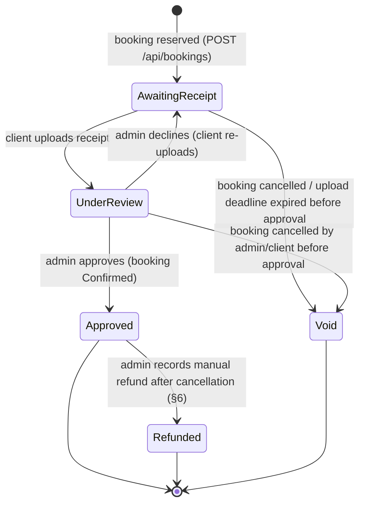

# 05 — Manual Payment Verification (Vodafone Cash / InstaPay)

Status: **Spec only — not implemented until explicitly requested.**

## 1. Overview

Per SDD §5.4: single flat session price (default 500 EGP, admin-editable). There is **no online payment gateway**. The client pays **out-of-band** by transferring the session fee to the consultant's **Vodafone Cash** number or **InstaPay** handle, then uploads a **receipt image** as proof. The **admin manually reviews the receipt and approves or declines** it. A booking is only `Confirmed` after the admin approves — never automatically.

This replaces the previous automated gateway entirely: there are no webhooks, no HMAC verification, no amount/currency auto-matching, no payment-initiate step, and no automated refund saga. Amount verification is now a **human step** (the admin eyeballs the receipt against the expected `Payment.Amount`).

## 2. Payment Flow

1. **Reserve (`POST /api/bookings`, spec 04)** creates the 1:1 `Payment` row with `Status = AwaitingReceipt` and the frozen `Amount`/`Currency` snapshot, and sets `Booking.Status = PendingPayment` with `ReceiptUploadDeadlineUtc = now + Settings.ReceiptUploadWindowMinutes` (default 60 min).
2. **Show instructions**: the client is shown the transfer details — `Settings.VodafoneCashNumber`, `Settings.InstaPayHandle`, the exact `Amount` to send, the optional `PaymentInstructions` note, and the upload deadline (`GET /api/bookings/{id}/payment-instructions`).
3. **Client transfers** the fee externally via their Vodafone Cash / InstaPay app.
4. **Upload receipt (`POST /api/payments/{bookingId}/receipt`)**: the client selects which method they used and uploads the receipt image.
   - **External-storage transaction boundary (resolved):** blob upload and SQL commit are split into safe phases because they cannot be one ACID transaction:
     1. Upload to a temporary blob key.
     2. Open DB transaction; create `PaymentReceipt` (`ReviewStatus = Pending`), set `Payment.Method`, `Payment.Status = UnderReview`, `Booking.Status = PendingApproval`, clear `ReceiptUploadDeadlineUtc`, enqueue admin-review outbox message.
     3. Commit DB; move/rename blob to final key (or mark final in metadata).
     4. If any post-commit blob step fails, mark the receipt row `BlobFinalizePending` and let the storage-recovery job (spec 08) reconcile.
   - This prevents silent divergence between blob and DB state.
5. **Admin reviews (`GET /api/admin/bookings/{id}/receipts`)**: returns the attempt history plus **short-lived SAS read URLs** for the private blob images.
6. **Approve (`POST /api/admin/bookings/{id}/receipts/approve`)**: in one DB transaction set the latest `PaymentReceipt.ReviewStatus = Approved`, `Payment.Status = Approved`, `Booking.Status = Confirmed` (writing a `BookingStatusAudit` row), and enqueue the client confirmation + admin new-booking emails to the outbox.
7. **Decline (`POST /api/admin/bookings/{id}/receipts/decline`, body `{ reasonCode, reasonNote? }`)**: set the latest `PaymentReceipt.ReviewStatus = Declined` with typed reason + optional note, `Payment.Status = AwaitingReceipt`, `Booking.Status = PendingPayment`, and a **fresh** `ReceiptUploadDeadlineUtc = now + Settings.ReceiptUploadWindowMinutes`; enqueue a "please re-upload" email carrying the reason. The client may re-upload (the slot stays held).

All state changes are guarded by `Booking.RowVersion` (spec 01), so concurrent admin actions or a client re-upload racing an admin decision resolve to a single winner (HTTP 409 for the loser). Approve/decline transitions update `Booking`, `Payment`, and the latest `PaymentReceipt` in one DB transaction with expected-state predicates on all involved rows (`Booking.Status`, `Payment.Status`, `PaymentReceipt.ReviewStatus`) to prevent split-brain states.

## 3. Endpoints

| Endpoint | Auth | Purpose |
|---|---|---|
| `GET /api/bookings/{id}/payment-instructions` | Client (owner) | Returns Vodafone Cash number, InstaPay handle, amount, optional instructions, and the upload deadline for a `PendingPayment` booking. |
| `POST /api/payments/{bookingId}/receipt` | Client (owner) | Multipart: `image` file + `method` (`VodafoneCash`\|`InstaPay`) + optional `senderReference`. Allowed only while the booking is `PendingPayment` and before `ReceiptUploadDeadlineUtc`. Moves the booking to `PendingApproval`. |
| `GET /api/admin/bookings/{id}/receipts` | Admin | Returns `PaymentReceipt` attempt history + short-lived SAS URLs to view images. |
| `POST /api/admin/bookings/{id}/receipts/approve` | Admin | Approves the pending receipt → booking `Confirmed`. |
| `POST /api/admin/bookings/{id}/receipts/decline` | Admin | Body `{ reasonCode, reasonNote? }`. Declines pending receipt → booking back to `PendingPayment` with a new upload window. |
| `POST /api/admin/payments/{id}/refunds/record` | Admin | Body `{ reference, note }`. Records a manual out-of-band refund on a cancelled booking's payment (§6). |
| `POST /api/admin/payments/{id}/refunds/revoke` | Admin | Body `{ correctionReason }`. Admin correction path for an accidentally recorded refund; appends audit and reopens refund-due state. |

## 4. File Upload & Storage (security)

- **Storage**: receipt images are stored in a **private Azure Blob Storage container** (`Storage:ReceiptContainer`). Blobs are given **random, unguessable names**; the original filename is kept only as display metadata on `PaymentReceipt`. Blobs are **never public**.
- **Admin access**: the admin views a receipt only via a **short-lived SAS read URL** minted on demand by `GET /api/admin/bookings/{id}/receipts`. URLs expire quickly (e.g. a few minutes) and are not persisted.
- **Validation** on upload:
  - Content-type allowlist: `image/jpeg`, `image/png`, `image/webp`, `application/pdf`.
  - Max size (e.g. **5 MB**), enforced before storing; `413`/`400` on violation.
  - **Magic-byte sniffing** to confirm the declared content-type matches the actual bytes (reject spoofed extensions).
  - Reject if the booking is not `PendingPayment` or the deadline has passed.
- **Anti-replay checks (resolved):**
  - Store a strong content hash (`SHA-256`) for every uploaded receipt.
  - On upload, search for hash matches and near-duplicate transfer signals (`method + senderReference + amount + recent window`) across bookings.
  - Matches do **not** auto-reject; they surface as a high-visibility warning in the admin review UI to reduce false positives while blocking screenshot reuse abuse.
- **Malware-safe handling (resolved):**
  - Uploaded files are scanned by malware scanning before becoming reviewable.
  - Admin receipt viewing uses safe rendering (no active-content execution); risky content is forced-download or blocked.
- **Rate limiting** on the upload endpoint (spec 08) plus the size cap bound abuse.

## 5. Payment State Machine

## 6. Refunds (manual)

Refunds are **only** triggered by a cancellation and are handled **entirely out-of-band** — the admin sends the money back via Vodafone Cash / InstaPay themselves, then records it in the system. There is no automated refund call, no saga, and no reconciliation job.

- **When a refund is due**: approving a client cancellation request (spec 04 §3) or an admin direct-cancel of a `Confirmed` booking whose `Payment.Status = Approved`. The cancellation itself commits immediately (booking `Cancelled`, slot freed); the payment stays `Approved` and is flagged as **refund-due** in the admin UI (spec 07).
- **Recording the refund (integrity hardening):**
  - The admin performs the transfer, then calls `POST /api/admin/payments/{id}/refunds/record` with a **required** `reference` and optional note.
  - Endpoint is idempotent: if already `Refunded`, it returns success with current state and does not duplicate outbox effects.
  - Recording sets `Payment.Status = Refunded`, `RefundedAtUtc`, `RefundReference`, `RefundedByAdminId`, and enqueues the client refund confirmation email.
  - **Correction path:** if recorded by mistake, admin uses `POST /api/admin/payments/{id}/refunds/revoke` (with mandatory reason). This appends an audit record, reopens refund-due state, and notifies operations. No silent edits/deletes.
- **No approved payment**: cancelling a booking that was never approved (`AwaitingReceipt`/`UnderReview`) just sets `Payment.Status = Void` and emails a plain cancellation notice — nothing to refund.
- **Partial refunds** are out of scope; refunds are always the full session amount.

## 7. Configuration

- `Storage:ConnectionString`, `Storage:ReceiptContainer` — Azure Blob Storage (private container) for receipt images. Stored via `dotnet user-secrets` locally and environment variables / secret store in production; never committed.
- The Vodafone Cash number and InstaPay handle are **operational data** in `Settings` (admin-editable), not secrets.

## 8. Failure & Edge Cases

- **Client never uploads a receipt**: the upload-deadline cleanup job (spec 04 §5, spec 08) cancels the `PendingPayment` booking once `ReceiptUploadDeadlineUtc` passes, releases the slot, sets `Payment.Status = Void`, and emails the client.
- **Uploaded receipt is wrong/unreadable/underpaid**: the admin declines with a reason; the client re-uploads within a fresh window. Repeated declines simply reset the window; if the client stops re-uploading, the deadline cleanup eventually cancels the hold.
- **Client uploads twice quickly**: only allowed while `PendingPayment`; the first upload moves the booking to `PendingApproval`, so the second loses on the status guard / `RowVersion`.
- **Admin approves and declines concurrently** (two tabs): `RowVersion` guarantees exactly one wins; the other gets a 409.
- **Booking auto-cancelled while a receipt sits `PendingApproval`**: cannot happen — `PendingApproval` has no `ReceiptUploadDeadlineUtc` and the cleanup job only targets `PendingPayment`.
- **Blob/DB partial failure**: temporary/final blob mismatches are reconciled by a storage-recovery job (spec 08) that deletes orphan temp blobs and repairs `BlobFinalizePending` records.

## 9. Out of Scope

- Any online card/wallet gateway (Paymob, Fawry, etc.) — manual Vodafone Cash / InstaPay verification only for MVP.
- Automated refunds, partial refunds, and payment reconciliation jobs.

## 10. Open Items for This Area

- The consultant's Vodafone Cash number and InstaPay handle must be provided (configured in `Settings`) before this can be used — a provisioning input, not a design decision.
- An Azure Blob Storage account + private container must be provisioned; connection string supplied via secrets.
